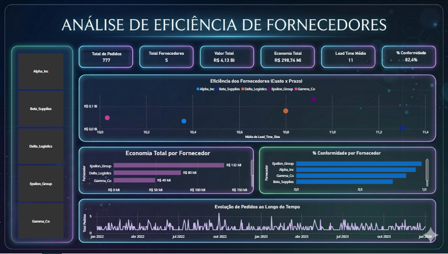
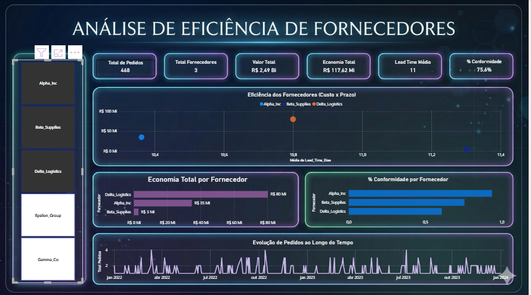
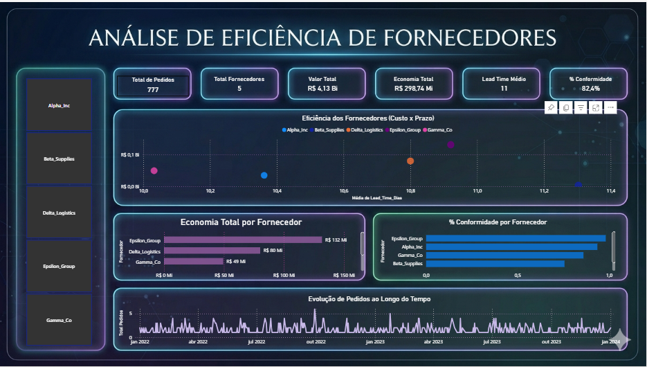
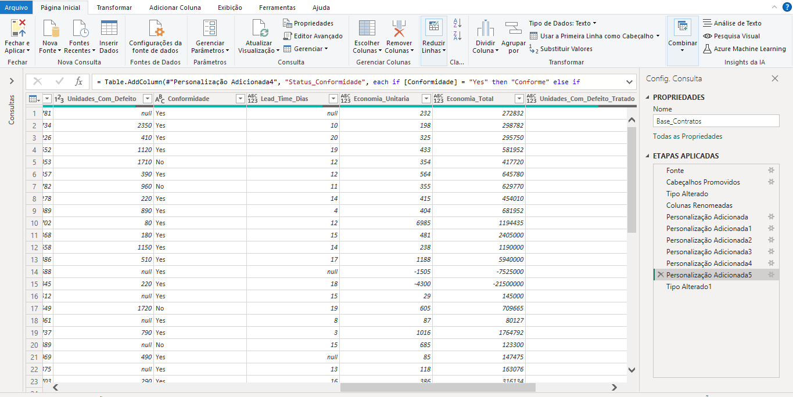

# 📊 Análise de Eficiência de Fornecedores

Projeto desenvolvido em Power BI com foco na análise de desempenho de fornecedores, considerando custo, prazo e conformidade.

---

## 🎯 Objetivo

Construir um dashboard interativo que permita identificar fornecedores mais eficientes, detectar riscos operacionais e apoiar a tomada de decisão baseada em dados.

---

## 📷 Dashboard



---

## 🎥 Demonstração

<video src="assets/video.mp4" controls width="700"></video>

---

## 🔍 Análise Interativa



O dashboard permite análise dinâmica por fornecedor, categoria e status do pedido, possibilitando diferentes visões do mesmo cenário.

---

## 📈 Destaque Analítico



O gráfico de dispersão permite identificar rapidamente fornecedores com melhor equilíbrio entre custo e prazo, facilitando decisões estratégicas.

---

## 🔧 Tratamento de Dados



O tratamento dos dados foi realizado no Power Query, incluindo:

- Padronização de colunas  
- Ajuste de tipos de dados  
- Tratamento de inconsistências  
- Criação de colunas calculadas (Lead Time, Economia, Taxa de Defeito)

---

## 📊 Métricas Criadas (DAX)

- Total de Pedidos  
- Total de Fornecedores  
- Valor Total  
- Economia Total  
- Lead Time Médio  
- % Conformidade  
- % Cancelados  

---

## 🧠 Principais Insights

- Identificação de fornecedores com melhor custo-benefício  
- Detecção de fornecedores com atrasos ou baixa qualidade  
- Avaliação do impacto financeiro das negociações  
- Visualização de tendências ao longo do tempo  

---

## 📂 Fonte de Dados

Dataset público obtido no Kaggle, simulando um cenário de procurement com informações de pedidos, fornecedores, preços, prazos e qualidade.

---

## 🚀 Tecnologias Utilizadas

- Power BI  
- Power Query  
- DAX  

---

## 📁 Estrutura do Projeto

```bash
📁analise-eficiencia-fornecedores-powerbi
│
├── dashboard.pbix
├── /assets
│ ├── dashboard-principal.png
│ ├── dashboard-filtro.png
│ ├── dashboard-scatter.png
│ ├── power-query-tratamento.png
│ ├── video.mp4
│
├── /docs
│ └── explicacao.pdf

```


---

## Autor

Projeto desenvolvido por **Fiama Ribeiro** como parte do do portfólio na área de análise de dados.
